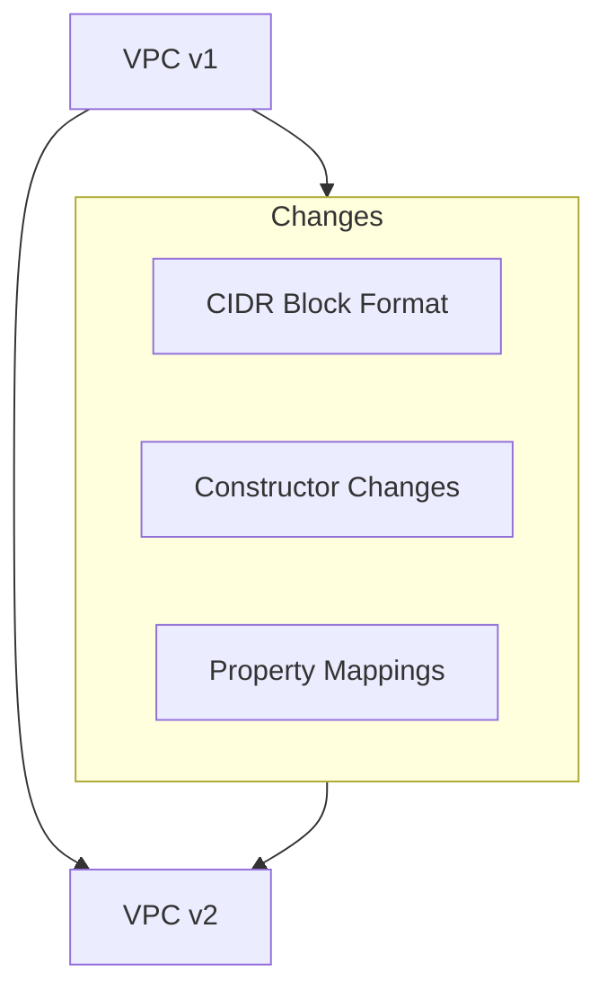
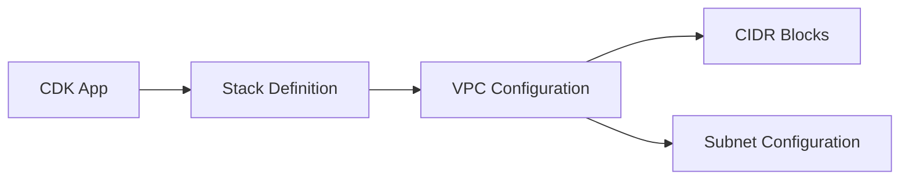

# System Patterns

## Architecture Overview
The project follows AWS CDK's infrastructure as code patterns, specifically focusing on VPC networking infrastructure.

## Migration Patterns
### VPC Migration Pattern


### Key Design Patterns
1. **Parallel Implementation**
   - Original stack preserved in `example_stack1-stack.ts`
   - New implementation in `example_stack1-stack-v2.ts`
   - Allows for safe migration and rollback capability

2. **Property Migration Pattern**
   ```typescript
   // Before: Direct CIDR Assignment
   new VPC({
     cidr: "10.0.0.0/16"
   })

   // After: IpAddresses Wrapper
   new VPCv2({
     primaryAddressBlock: IpAddresses.ipv4("10.0.0.0/16")
   })
   ```

## Component Relationships


## Technical Decisions
1. **Migration Strategy**
   - Incremental migration approach
   - Maintain existing CIDR configurations
   - Validate each migration step

2. **Version Control**
   - Separate files for v1 and v2 implementations
   - Clear separation of concerns
   - Easy rollback capability

3. **Testing Approach**
   - Unit tests for stack configuration
   - Infrastructure validation
   - CIDR range preservation verification

## Best Practices
1. Maintain existing CIDR ranges for network stability
2. Follow AWS CDK's latest VPC patterns
3. Ensure backward compatibility during migration
4. Comprehensive testing of network configurations
